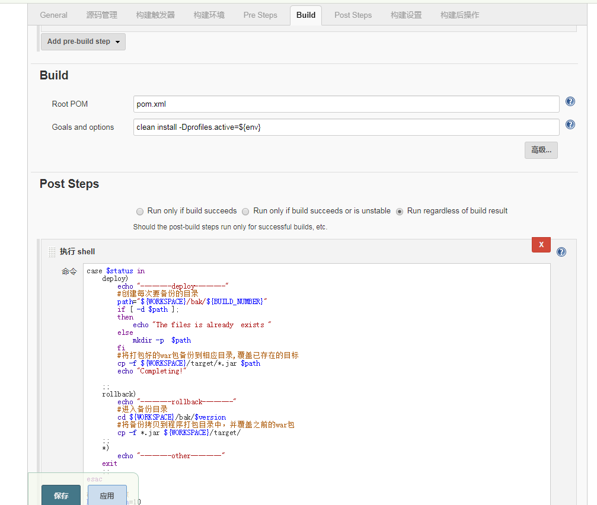
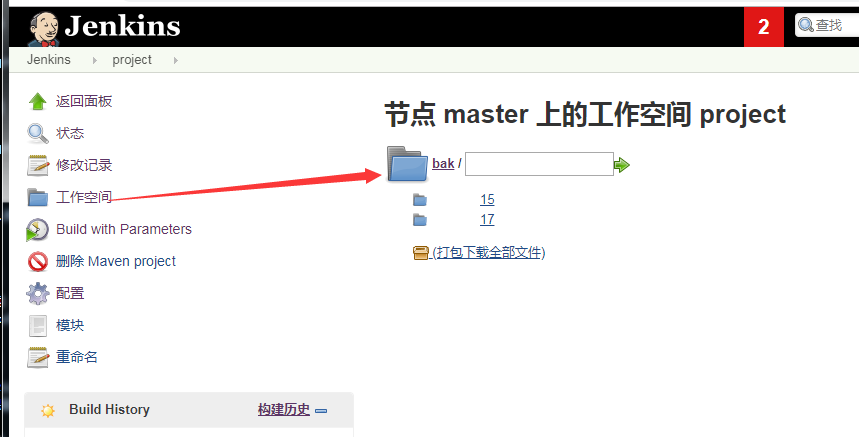

[Post Steps] - [执行 shell]
 ```
    case $status in
        deploy)
            echo "--------deploy--------"
            #创建每次要备份的目录
            path="${WORKSPACE}/bak/${BUILD_NUMBER}"
            if [ -d $path ];
            then
                echo "The files is already  exists "
            else
                mkdir -p  $path
            fi
            #将打包好的war包备份到相应目录,覆盖已存在的目标
            cp -f ${WORKSPACE}/target/*.jar $path
            echo "Completing!"
            
        ;;
        rollback)
            echo "--------rollback--------"
            #进入备份目录
            cd ${WORKSPACE}/bak/$version
            #将备份拷贝到程序打包目录中，并覆盖之前的war包
            cp -f *.jar ${WORKSPACE}/target/
        ;;
        *)
            echo "--------other--------"
        exit
        ;;
    esac    

    #保留文件数
    ReservedNum=10
    FileDir=${WORKSPACE}/bak/
    date=$(date "+%Y%m%d-%H%M%S")

    #进入备份目录
    cd $FileDir  
    #当前有几个文件夹，即几个备份
    FileNum=$(ls -l | grep '^d' | wc -l)   

    while(( $FileNum > $ReservedNum))
    do
        #获取最旧的那个备份文件夹
        OldFile=$(ls -rt | head -1)        
        echo  $date "Delete File:"$OldFile
        rm -rf $FileDir/$OldFile
        let "FileNum--"
    done 
```





可以在工作区查看所有历史版本

