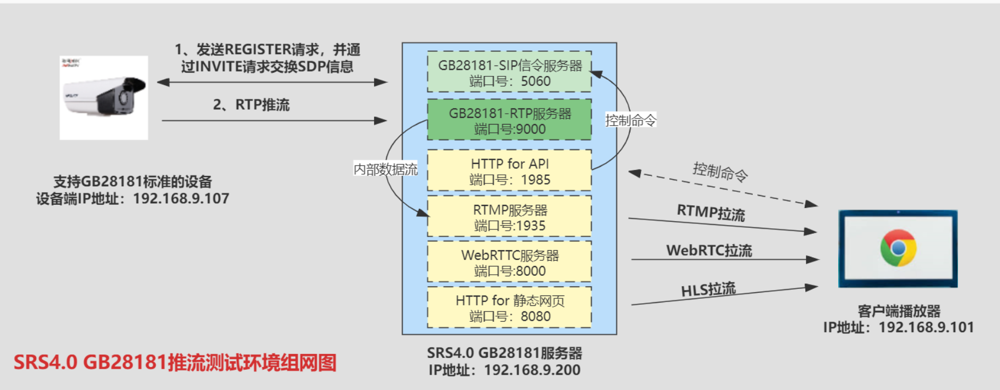

cp ./libsrtp2.pc /usr/local/src/srs-develop/trunk/objs/Platform-SRS6-Linux-3.10.0-GCC4.8.5-x86_64/3rdpatry/srtp2/lib/pkgconfig/
make: 离开目录“/usr/local/src/srs-develop/trunk/objs/Platform-SRS6-Linux-3.10.0-GCC4.8.5-x86_64/libsrtp-2-fit”
The libsrtp-2-fit is ok.
Building opus-1.3.1.
./auto/depends.sh:行553: autoreconf: 未找到命令
Build opus-1.3.1 failed.

wget https://archive.mozilla.org/pub/opus/opus-1.3.1.tar.gz
tar zxvf opus-1.3.1.tar.gz
cd opus-1.3.1
./configure  --enable-shared
make
make install

报错
Can't exec "aclocal": No such file or directory at /usr/share/autoconf/Autom4te/FileUtils.pm line 326.
autoreconf: failed to run aclocal: No such file or directory

 yum install automake

./auto/depends.sh:行553: autoreconf: 未找到命令
yum install -y autoconf

