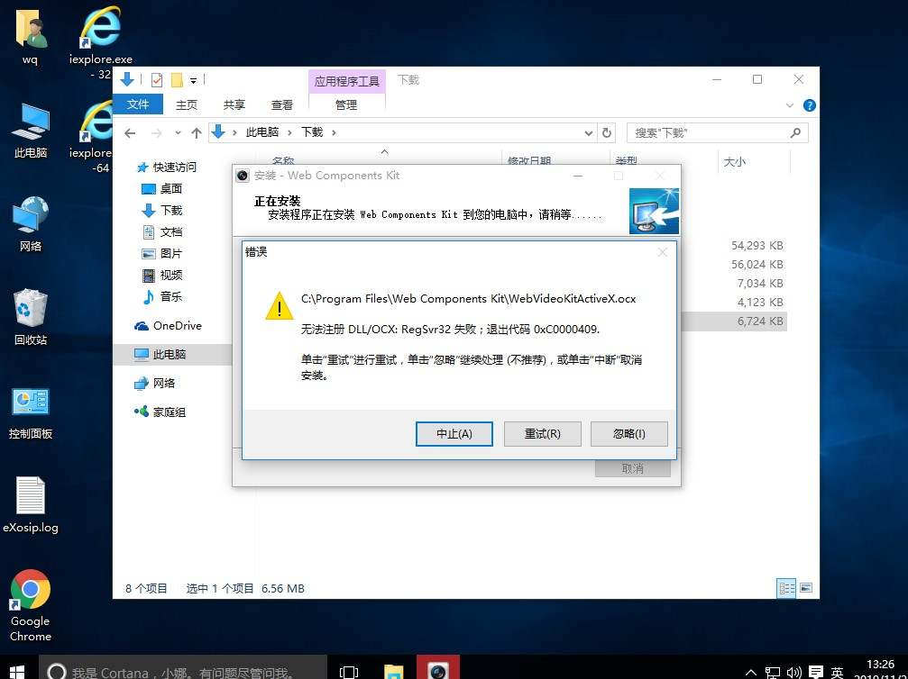
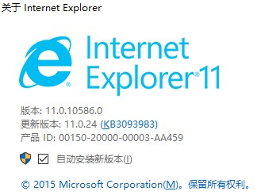
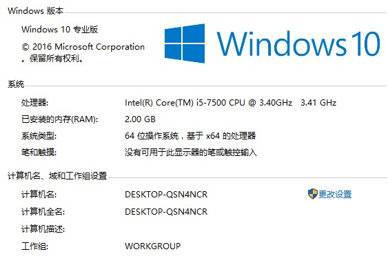
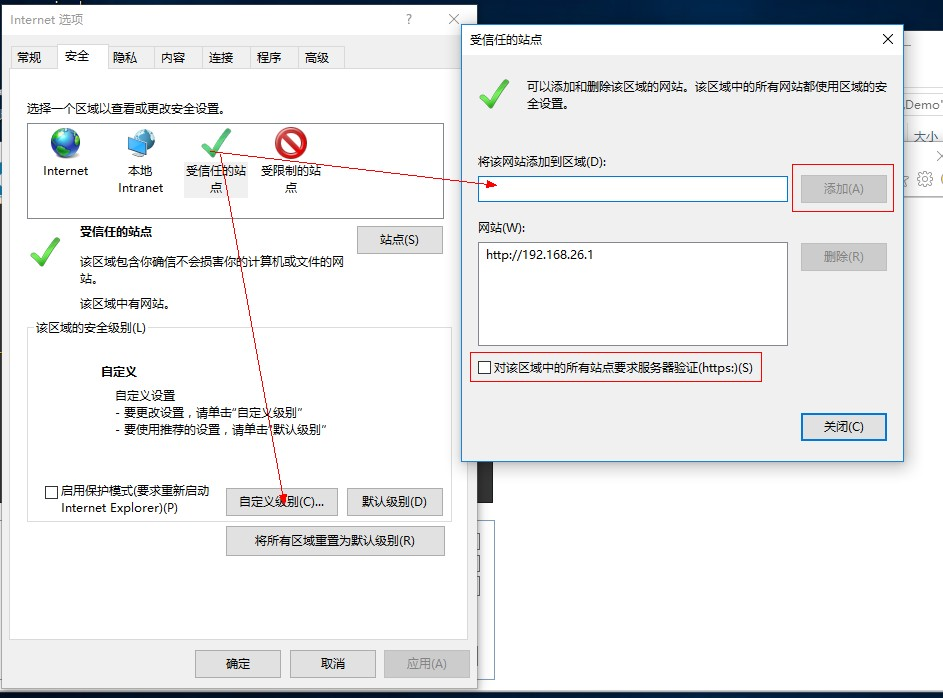
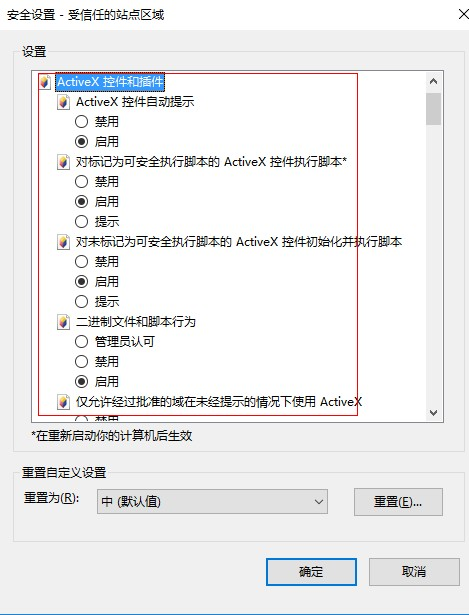
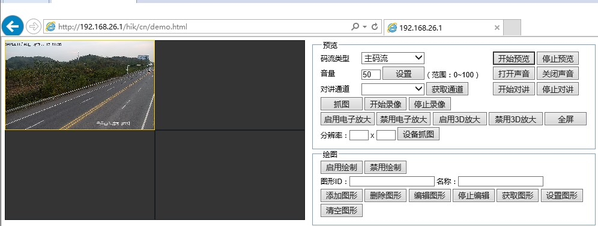

CH_WEB3.0控件开发包V1.1.0_Win32
CH_WEB3.0控件开发包V1.1.0_Win64

如果64位报错，由安装32位

demo\codebase\WebComponentsKit.exe

### win10安装海康web插件

* 64位IE
C:\Program Files\Internet Explorer\iexplore.exe
* 32位IE
C:\Program Files (x86)\Internet Explorer\iexplore.exe

### 安装插件
* CH_WEB3.0控件开发包V1.1.0_Win32
* CH_WEB3.0控件开发包V1.1.0_Win64

安装WebComponentsKit.exe，如果报以下错误，请换个32位安装

### 看下当前操作系统版本和浏鉴器版本

### 安装好之后要在配置IE 使active插件生效 
1. 添加信任站点

2. 安全设置-active选项里全部改启用或提示，如果你是高手可以按需配置。

3. 访问成功，web服务需要在nginx里配置，这个单独再说，这里注要是说客户的软件环境配置。
