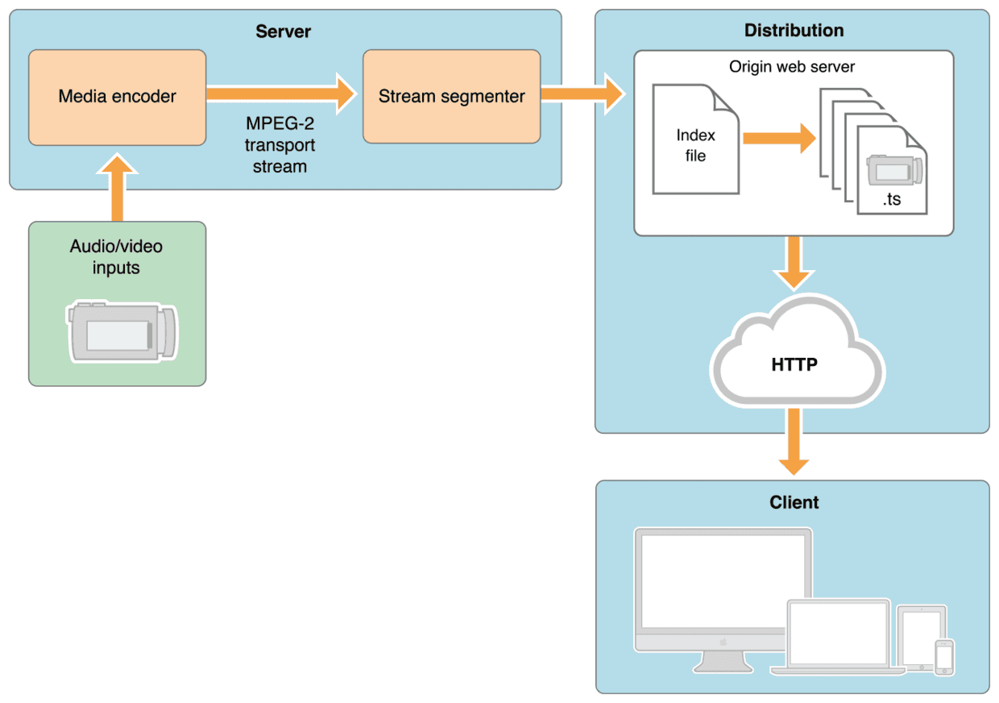
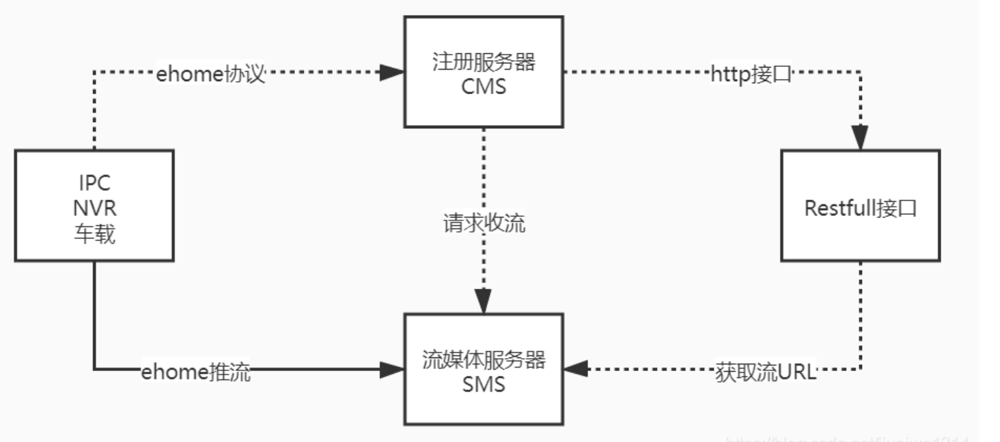

## RTSP
实时流传输协议（Real Time Streaming Protocol，RTSP），RFC2326（中文版），是TCP/IP协议体系中的一个应用层协议，由哥伦比亚大学、网景和RealNetworks公司提交的IETF RFC标准。该协议定义了一对多应用程序如何有效地通过IP网络传送多媒体数据。RTSP在体系结构上位于RTP和RTCP之上，它使用TCP或UDP完成数据传输。
RTSP是基于文本的协议，采用ISO10646字符集，使用UTF-8编码方案。行以CRLF中断，包括消息类型、消息头、消息体和消息长。
协议主要规定定了一对多应用程序如何有效地通过IP网络传送多媒体数据。RTSP体系结位于RTP和RTCP之上（RTCP用于控制传输，RTP用于数据传输），使用TCP或UDP完成数据传输！
RTSP旨在建立和维护原始数据源（客户端）和流服务器之间的连接，允许控制流媒体服务器内的娱乐和通信系统，允许暂停和播放功能，RTSP是 RealNetworks于 1996 年 与 Netscape 和哥伦比亚大学联合开发的协议。

这种可靠性和控制性的结合使RTSP成为闭路电视 (CCTV) 和类似 监控系统的热门选择。因此，它是许多 IP 摄像机的首选协议。
但RTSP协议一般传输的是ts,mp4格式的流
优点：
1. 轻松自定义流
可以通过结合不同的协议来开发自己的视频流解决方案。
2. 分段流式传输
RTSP 流使观看者能够在下载完成之前访问的视频内容，而不必下载完整的视频以流式传输内容。

缺点：
1. 与 HTTP 不兼容
没有简单的解决方案可以在 Web 浏览器中播放 RTSP流，因为 RTSP 旨在通过私有网络流式传输视频，必须借用额外软件。
2. 使用率低
由于视频播放器和流媒体服务并未广泛支持 RTSP 流媒体，因为使用率比较低。

IP 摄像机选择RTSP
几乎所有 IP 摄像机都支持 RTSP，这是因为 IP 摄像机早在 RTMP 协议创建之前就已经存在，与 RTSP 和 IP 摄像机结合使用时，IP 摄像机本身充当 RTSP 服务器，这意味着要将摄像机连接到 IP 摄像机服务器并广播视频。
物联网设备选择RTSP
RTSP 通常内置在无人机或物联网软件中，从而可以访问视频源，它的好处之一是低延迟，确保视频中没有延迟，这对于无人机来说至关重要。

## RTMP
RTMP (Real-Time Messaging Protocol)实时消息传递协议由 Macromedia（后来被 Adobe 收购）开发，用于流式传输到 Flash 播放器，随着 Flash 开始被淘汰并且基于 HTTP 的协议成为流式传输到播放设备的新标准，RTMP在流媒体协议中的地位越来越低。
RTMP协议一般传输的是flv，f4v格式流。
优点：
1. 低延迟：RTMP使用独占的 1935 端口，无需缓冲，可以实现低延迟。
2. 适应性强：所有 RTMP 服务器都可以录制直播媒体流，同时还允许观众跳过部分广播并在直播开始后加入直播流。
3. 灵活性：RTMP 支持整合文本、视频和音频，支持 MP3 和 AAC 音频流，也支持MP4、FLV 和 F4V 视频。
缺点
1. HTML5 不支持：标准HTML5 播放器不支持 RTMP 流。
2. 容易受到带宽问题的影响：RTMP 流经常会出现低带宽问题，造成视频中断。
3. HTTP 不兼容：无法通过 HTTP 流式传输 RTMP，必须需要实现一个特殊的服务器，并使用第三方内容交付网络或使用流媒体视频平台。 

流媒体应用程序选择RTMP，比如各种短视频软件、视频软件等都内置了RTMP，RTMP 是为满足现代流媒体需求而设计的。

RTSP传输一般需要2-3个通道，命令和数据通道分离，RTMP一般在TCP一个通道上传输命令和数据。

## RTP
（real-time transport protocol, 实时传输协议)，在多点传送（多播）或单点传送（单播）的网络服务上，提供端对端的网络传输功能，适合应用程序传输实时数据，如：音频，视频或者仿真数据。RTP没有为实时服务提供资源预留的功能，也不能保证QoS（服务质量）。
数据传输功能由一个控制协议（RTCP）来扩展，通过扩展，可以用一种方式对数据传输进行监测控制，该协议（RTCP）可以升级到大型的多点传送（多播）网络，并提供最小限度的控制和鉴别功能。RTP和RTCP被设计成和下面的传输层和网络层无关。协议支持RTP标准的转换器和混合器的使用。

## RTCP
（Real-time Transport Control Protocol或RTP Control Protocol，实时传输控制协议）是实时传输协议（RTP）的一个姐妹协议，由RFC 3550定义（取代作废的RFC 1889）。
RTP 使用一个 偶数 UDP port ；而RTCP 则使用 RTP 的下一个 port，也就是一个奇数 port。RTCP与RTP联合工作，RTP实施实际数据的传输，RTCP则负责将控制包送至电话中的每个人。其主要功能是就RTP正在提供的服务质量做出反馈。
RTCP协议处理机根据定义了五种类型的报文：
* SR: sender report
* RR: receiver report
* SDES: source description items.
* BYE: indicates end of participation.
* APP: application specific functions
* SR报文用于发送端报告本端的数据发送统计信息和数据接收统计信息，RR报文用于报告本端的数据接收统计信息，SDES报文用于报告本端的描述性信息，BYE在本端离开会话时发送，而APP则是特定于应用的数据。

## SRTP/SRTCP
SRTP（Secure Real-time Transport Protocol，安全实时传输协议）是在实时传输协议RTP基础上所定义的一个协议，旨在为单播和多播应用程序中的实时传输协议的数据提供加密、消息认证、完整性保证和重放保护。它是由David Oran（思科）和Rolf Blom（爱立信）开发的，并最早由IETF于2004年3月作为RFC3711发布。
由于RTP协议和RTCP协议有着紧密的联系，SRTP同样也有一个伴生协议RTCP（Secure RTCP或SRTCP， 安全实时传输控制协议）。SRTCP为RTCP提供类似的与安全有关的特性，就像SRTP为RTP提供的那些一样。
在使用RTP或RTCP时，使不使用SRTP或SRTCP协议是可选的；但即使使用了SRTP或SRTCP，所有它们提供的特性（如加密和认证）也都是可选的，这些特性可以被独立地使用或禁用。唯一的例外是在使用SRTCP时，必须要用到其消息认证特性。

## HLS协议
HTTP Live Streaming（缩写是HLS）是一个由苹果公司提出的基于HTTP的流媒体网络传输协议。是苹果公司QuickTime X和iPhone软件系统的一部分。它的工作原理是把整个流分成一个个小的基于HTTP的文件来下载，每次只下载一些。当媒体流正在播放时，客户端可以选择从许多不同的备用源中以不同的速率下载同样的资源，允许流媒体会话适应不同的数据速率。在开始一个流媒体会话时，客户端会下载一个包含元数据的extended M3U (m3u8)playlist文件，用于寻找可用的媒体流。
HLS只请求基本的HTTP报文，与实时传输协议（RTP)不同，HLS可以穿过任何允许HTTP数据通过的防火墙或者代理服务器。它也很容易使用内容分发网络来传输媒体流。
但HLS也有一些无法跨越的坑，比如采用HLS协议直播的视频延迟时间无法下到10秒以下，而RTMP协议的延迟最低可以到3、4秒左右。所以说对直播延迟比较敏感的服务请慎用HLS。

##  onvif协议
摄像头在我们的日常生活中可以说时随处可见。而在当下的时代，大多数摄像头都已经网络化，早期的网络摄像机硬件提供商都采用私有协议进行通讯。但随着时代的发展，摄像头的应用场景越来越多，各个摄像头的厂商也是百花齐放。私有协议终究会被淘汰。为了解决这一困境，安讯士联合博世及索尼公司，共同制定了onvif（Open Network Video Interface Forum，开放型网络视频接口论坛）协议。

onvif协议涵盖了设备发现、设备配置、事件、PTZ控制、视频分析和实时流媒体直播功能，以及搜索，回放和录像录音管理功能。

ONVIF规范中设备管理和控制部分所定义的接口均以Web Services的形式提供。每一个支持ONVIF规范的终端设备均须提供与功能相应的Web Service。ONVIF中的其他部分比如音视频流则通过RTP/RTSP进行。
总结onvif协议的开发公式：ONVIF = 服务端 + 客户端 =（Web Services + RTSP）+ 客户端 = （（WSDL + SOAP） + RTSP） + 客户端

### 流程
* 发现设备
* 获取能力
* 获取媒体信息
* 获取视频编码配置
* 设置视频编码配置（修改视频流设置信息，码流，分辨率，编码格式）
* 获取URI
* ONVIF完成
* 使用RTSP协议播放音视频

### profile
onvif定制了一系列的协议规范profiles，profiles协议协议要求客户端和设备彼此必须支持一组功能：
* Profile A：用于门禁控制配置，适用于电子门禁系统中使用的产品。
* Profile C：用于门控和事件管理，适用于电子门禁系统中使用的产品。
* Profile D – 候选版：用于访问控制周边设备，适用于周边设备的输入界面，例如令牌读取器（用于读取卡，钥匙，移动电话或条形码），生物识别读取器（用于指纹识别），相机（用于虹膜，面部或车牌识别），按键，传感器（用于识别锁状态，门状态，温度或动作）和部分输出设备（例如锁，显示器和LED)。
* Profile G：用于存储和检索，专为基于IP的视频系统而设计，支持元数据的分析配置和信息查询，以及元数据的过滤和流式传输。
* Profile Q： 用于快速安装，基于IP的视频系统，其目的是在网络上提供Profile Q一致产品（例如，网络摄像机，网络交换机，网络监视器）的快速发现和基本配置。
* Profile S：用于基本视频流，专为基于IP的视频系统而设计。
* Profile T：适用于高级视频流，专为基于IP的视频系统而设计。

https://www.onvif.org/ch/profiles/

## 海康ehome
EHOME协议是设备和服务器通信的一种推模式协议，适用于支持EHOME协议的网络摄像机、网络球机、DVR、NVR、车载DVR、车载取证系统、单兵、报警主机等设备。
海康设备可以基于ehome协议来主动注册云端，区别于onvif只能在局域网内使用的限制。
本服务软件基于海康私有协议ehome v2.x版本，力争打造一个开源安防基础产品。

ehome协议是海康的私有协议，相对于GB28181国标协议都是基于设备端主动向平台注册，更适用于无固定ip地址的设备，只需要配置一下设备注册地址即可云端使用。

## WebRTC
WebRTC (Web Real-Time Communications) 是一项实时通讯技术，它允许网络应用或者站点，在不借助中间媒介的情况下，建立浏览器之间点对点（Peer-to-Peer）的连接，实现视频流和（或）音频流或者其他任意数据的传输。WebRTC 包含的这些标准使用户在无需安装任何插件或者第三方的软件的情况下，创建点对点（Peer-to-Peer）的数据分享和电话会议成为可能。 
WebRTC vs WebSocket
1. 用途区别
    * WebSocket允许浏览器和Web服务器之间进行全双工通信.
    * WebRTC允许两个浏览器之间的全双工通信。
2. 协议区别
    * WebSocket使用TCP协议
    * WebRTC使用UDP协议
3. 流量路径
    * WebSocket浏览需要经过服务器
    * WebRTC是直接连接，浏览不会经过第三方服务器，是一个去中心化的架构模型，简单说就是省带宽。
4. 实时性
    * WebSocket延迟高（不是直接连接）
    * WebRTC延迟低
通常WebRTC会与WebSocket配合使用，WebSocket的作用主要是用来交换客户端的SDP与网络信息，Websocket传输的内容与真正通信数据无关，只是协助WebRTC建立连接